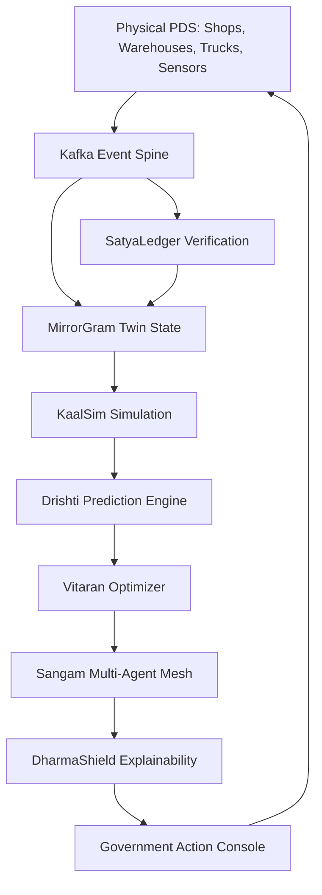
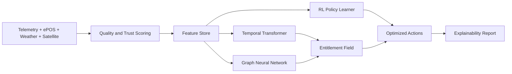
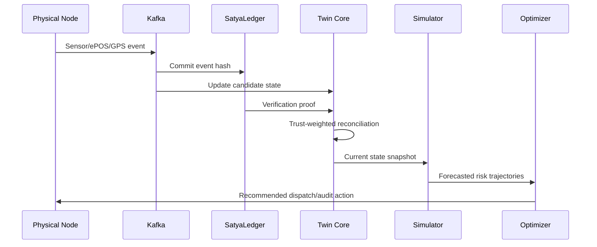
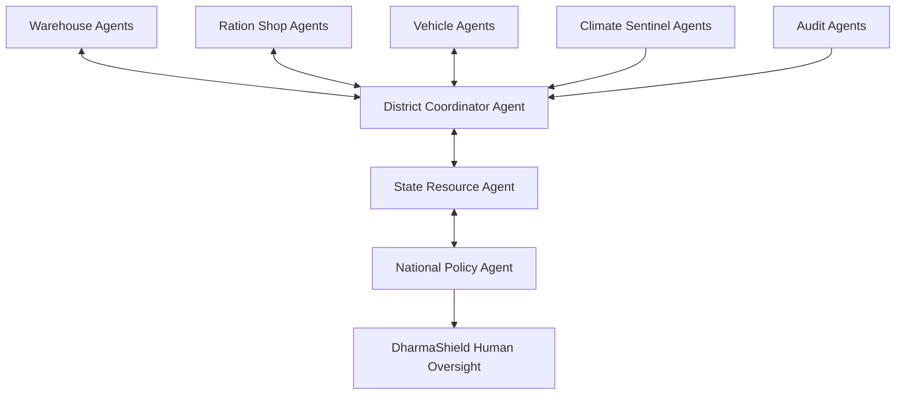

# PDS-DigitalTwin: **AstraKshetra Nexus (AKN)**

**Research tagline:** *A sovereign, self-healing digital twin nervous system for climate-aware, corruption-resistant public distribution.*

**Futuristic slogan:** *Every grain mirrored. Every route reasoned. Every citizen protected.*

**Mission statement:** AstraKshetra Nexus transforms Public Distribution Systems (PDS) into a real-time cyber-physical intelligence grid that predicts scarcity, exposes leakage, autonomously rebalances stock, and gives governments explainable policy actions before citizens experience disruption.

---

## 1. Project Title

**Title:** **AstraKshetra Nexus: Sovereign AI Digital Twin for Public Distribution Optimization**  
**Acronym:** **AKN-PDS**  
**Framework name:** **PDS-DigitalTwin / AstraKshetra Nexus**  
**Core thesis:** Public distribution can be operated as a living, self-correcting national digital organism where supply-chain entities, beneficiaries, climate signals, policy constraints, and fraud risks are continuously mirrored, simulated, optimized, and audited.

---

## 2. Grand Problem Statement

Public Distribution Systems are among the most consequential welfare infrastructures in the world, but many operate as fragmented administrative pipelines rather than adaptive, instrumented, intelligence-driven networks. The result is a persistent gap between entitlement and delivery.

Key systemic failures include:

* **Leakage and diversion:** Stock can disappear between procurement centers, warehouses, fair-price shops, and beneficiaries because physical movement, inventory declarations, biometric transactions, and transport telemetry are rarely fused into a single verifiable state model.
* **Black-market diversion and hoarding:** Local actors may exploit low observability, delayed audits, and weak cross-district reconciliation to redirect subsidized commodities to unauthorized markets.
* **Inefficient allocation:** Static monthly quotas cannot respond quickly to migration, festivals, school closures, pandemics, floods, droughts, heatwaves, labor shocks, or transport outages.
* **Outdated forecasting:** Traditional demand projections usually rely on historical averages and beneficiary rosters, underusing weather, satellite, crop, mobility, price, social-signal, and last-mile queue data.
* **Corruption and collusion:** Fraud patterns are often relational and temporal: repeated short delivery, ghost lifting, synchronized route deviations, biometric replay, inventory overstatement, and shop-level ration denial. These patterns require graph and sequence intelligence.
* **Climate disruptions:** Extreme weather can damage roads, delay trucks, reduce crop output, increase demand, and create local scarcity. Current PDS logistics are typically reactive, not climate-anticipatory.
* **Population demand uncertainty:** Internal migration, informal settlements, seasonal labor flows, and disaster displacement alter entitlement demand faster than administrative records update.

The grand challenge is therefore not only digitization. It is the creation of an **autonomous, explainable, sovereign cyber-physical decision infrastructure** for food and essential-goods security.

---

## 3. The Invention

**AstraKshetra Nexus** is an original multi-layer framework that combines real-time digital twins, federated rural AI, reinforcement learning logistics, blockchain-backed provenance, edge intelligence, and explainable governance into a single national-scale PDS operating system.

### Core invention modules

1. **Annapurna Twin Core (ATC):** Maintains executable digital replicas of ration shops, warehouses, trucks, stock lots, beneficiaries, entitlement rules, road corridors, risk zones, and policy constraints.
2. **KaalSim Dynamic Simulation Layer:** Runs rolling-time simulations of demand, queue pressure, spoilage, truck flow, warehouse depletion, disaster impact, and adversarial leakage scenarios.
3. **Drishti Predictive Intelligence Engine:** Forecasts demand spikes, stock-outs, leakage probability, corruption risk, route delay, climate disruption, and beneficiary distress.
4. **Vitaran Adaptive Resource Optimizer:** Solves multi-objective allocation across equity, cost, freshness, carbon, urgency, fraud risk, and route reliability.
5. **Rajya Autonomous Decision Mesh:** A hierarchy of AI decision agents that recommend, negotiate, and escalate actions from village to national level.
6. **Sangam Multi-Agent Coordination System:** Coordinates shop agents, warehouse agents, truck agents, climate agents, audit agents, and policy agents through contract-net bidding and swarm reinforcement learning.
7. **SatyaLedger Verification Layer:** Uses Hyperledger Fabric to register signed stock events, route proofs, biometric transaction hashes, anomaly attestations, and audit trails.
8. **GramEdge Intelligence Nodes:** Rugged edge devices at warehouses, trucks, and fair-price shops performing offline inference, sensor fusion, fraud detection, and store-and-forward synchronization.
9. **Federated Rural AI Fabric:** Trains local models without centralizing sensitive beneficiary data, using secure aggregation, differential privacy, and rural connectivity-aware update scheduling.
10. **Punarnirman Self-Healing Logistics Network:** Detects broken distribution paths and automatically proposes reroutes, pop-up depots, mobile ration vans, buffer release, and inter-district balancing.

### Why the architecture is globally unique

AKN-PDS is unique because it treats public distribution as an **executable national twin** rather than a dashboard, MIS portal, or analytics tool. It introduces a closed-loop pipeline: **observe → verify → mirror → simulate → optimize → govern → audit → learn**, where each step is cryptographically anchored, physically sensed, edge-operable, and explainable. Unlike conventional supply-chain systems, it models **citizen entitlement as a protected optimization constraint**, not as a passive demand signal.

---

## 4. Ultra-Advanced System Architecture

### A. Physical Layer: BharatMesh Sensorium

* **Ration shops:** ePOS systems, weighing scales, QR/NFC lot scanners, queue sensors, thermal cameras where lawful, and beneficiary grievance kiosks.
* **Warehouses:** smart bins, humidity sensors, fumigation logs, stock-lot RFID, loading-bay computer vision, spoilage detection, and tamper sensors.
* **Trucks:** GPS, fuel telemetry, door-open sensors, inertial deviation detectors, route cameras, temperature sensors, and secure driver identity modules.
* **Biometric and identity devices:** privacy-preserving authentication that writes only salted transaction commitments to verification infrastructure.
* **External feeds:** weather forecasts, flood maps, satellite road observability, crop-yield estimates, local market prices, disaster alerts, and population mobility aggregates.

### B. Cyber Layer: MirrorGram Twin Space

* **Entity twins:** executable state objects for shops, warehouses, trucks, stock lots, roads, administrative regions, and beneficiary cohorts.
* **Behavioral simulation:** stochastic models for demand arrival, ration lifting, shop opening behavior, truck dwell time, spoilage, route failures, and adversarial diversion.
* **Real-time synchronization:** event sourcing reconciles IoT streams, ledger proofs, manual inspections, and model predictions into a confidence-weighted state.

### C. Intelligence Layer: Samvit AI Cortex

* **LLM orchestration:** Converts policy questions into constrained simulations, explains recommendations, drafts audit memos, and summarizes district-level risk.
* **Reinforcement learning:** Learns allocation, routing, buffer release, and emergency logistics policies under uncertain demand and climate disruptions.
* **Graph neural networks:** Detect collusive leakage patterns across shops, trucks, warehouses, officials, routes, and stock-lot histories.
* **Anomaly detection:** Identifies inventory gaps, impossible travel paths, suspicious transaction timing, biometric replay signatures, and stock-weight inconsistencies.
* **Predictive analytics:** Forecasts commodity demand, delay probability, stock-out risk, distress zones, and wastage.
* **Swarm intelligence:** Local agents cooperate through district-level auctions to minimize citizen deprivation and logistics instability.

### D. Governance Layer: DharmaShield Explainable Control Plane

* **Explainable AI:** Every recommendation includes causal drivers, uncertainty, counterfactuals, and policy constraints.
* **Trust scoring:** Shops, trucks, warehouses, and routes receive dynamic trust scores based on verified behavior and anomaly history.
* **Auditability:** Each decision is linked to source events, model version, feature snapshot, optimization objective, and ledger commitment.
* **Anti-corruption AI:** Fraud hypotheses are scored using graph motifs, temporal anomalies, stock reconciliation gaps, and field-inspection feedback.

### E. Autonomous Layer: Pravaah Self-Regulation Plane

* **Self-adjusting logistics:** Automatically recomputes truck dispatch and warehouse replenishment plans when risk thresholds change.
* **Adaptive route optimization:** Uses road reliability, climate exposure, fuel cost, and fraud-risk corridors.
* **Dynamic stock balancing:** Shifts buffer stocks across warehouses and shops according to demand uncertainty and entitlement criticality.

---

## 5. Unique Research Novelty: Patent-Worthy Innovations

1. **Entitlement-Preserving Digital Twin State Machine:** A digital twin representation where citizen entitlement constraints are first-class invariants during simulation and optimization.
2. **KshetraPulse Geo-Causal Demand Genome:** A spatiotemporal demand model that encodes local festivals, migration, climate exposure, crop cycles, school calendars, and price shocks into a demand DNA vector.
3. **SatyaLedger-Twin Reconciliation Protocol:** A cryptographic reconciliation method comparing physical sensor events, ledger commitments, and simulated twin state to produce tamper-evident divergence scores.
4. **Swarm-RL Fairness Auction:** Multi-agent reinforcement learning where shop, warehouse, and vehicle agents bid for scarce inventory using deprivation-weighted utility instead of profit.
5. **ShadowLeak Graph Motif Detector:** A graph neural anomaly engine that discovers collusive diversion rings through repeated stock-lot, route, timing, and officer-shop motifs.
6. **Climate-Elastic Ration Routing:** A logistics optimizer that incorporates flood depth, heat index, road washout probability, and perishability into route and allocation decisions.
7. **Offline-First Federated Twinlets:** Lightweight rural edge twins that keep simulating and detecting anomalies when disconnected, then merge with the sovereign twin using conflict-aware synchronization.
8. **Policy Wind-Tunnel Simulator:** A counterfactual AI sandbox that tests subsidy changes, portability rules, emergency buffers, and delivery models before field deployment.
9. **Trust-Weighted Sensor Fusion Ledger:** A mechanism that assigns adaptive trust to sensors and human reports based on historical calibration, adversarial exposure, and cross-source agreement.
10. **Self-Healing Depot Morphogenesis:** Algorithms that temporarily create pop-up depots and mobile-ration corridors in response to simulated deprivation gradients.
11. **Civic Distress Early-Warning Index:** A fused score combining stock-out risk, queue pressure, weather hazard, grievance velocity, and price anomalies.
12. **Sovereign Model Provenance Capsule:** A model registry artifact binding training data lineage, hyperparameters, fairness tests, edge deployment hash, and governance approval.
13. **Beneficiary Privacy Entitlement Tokenization:** Privacy-preserving proofs that validate transaction eligibility without exposing sensitive identity attributes to analytics layers.
14. **Twin-Conditioned LLM Policy Compiler:** An LLM planner that transforms natural-language policy goals into executable optimization constraints and simulation scenarios.
15. **Corruption Reduction Intelligence Index (CRII):** A national metric quantifying the probability-adjusted reduction of leakage and collusive fraud over time.

---

## 6. Mathematical Model

Let the PDS network be a dynamic graph \(G_t=(V_t,E_t)\), where nodes represent warehouses, shops, trucks, districts, and beneficiary cohorts. Edges encode routes, administrative dependencies, transfer corridors, and observed stock-lot movement.

### Predictive demand

For shop \(i\), commodity \(c\), and horizon \(h\):

\[
\hat{D}_{i,c,t+h}=f_\theta\left(X^{hist}_{i,c,1:t}, W_{i,t:t+h}, M_{i,t}, P_{i,t}, C_{i,t}, E_{i,t}\right)
\]

where \(W\) is weather risk, \(M\) is mobility, \(P\) is local price pressure, \(C\) is calendar context, and \(E\) is entitlement population.

### Dynamic allocation

Decision variable \(x_{j\rightarrow i,c,t}\) is the quantity of commodity \(c\) shipped from warehouse \(j\) to shop \(i\):

\[
\min_x \sum_{i,c}\alpha U_{i,c,t}(x)+\beta R^{stockout}_{i,c,t}(x)+\gamma Cost_{route}(x)+\delta CO2(x)+\eta FraudRisk(x)
\]

subject to:

\[
\sum_i x_{j\rightarrow i,c,t}\leq S_{j,c,t},\quad
I_{i,c,t}+\sum_j x_{j\rightarrow i,c,t}-\hat{D}_{i,c,t}\geq B^{min}_{i,c,t}
\]

\[
x_{j\rightarrow i,c,t}\geq 0,\quad FairnessGap_t\leq \epsilon,\quad LedgerValid(x)=1
\]

### Deprivation-weighted utility

\[
U_{i,c,t}=\omega_1\max(0,\hat{D}_{i,c,t}-I_{i,c,t})+\omega_2 Vulnerability_i+\omega_3 DisasterExposure_{i,t}
\]

### Reinforcement learning reward

For state \(s_t\), action \(a_t\), and next state \(s_{t+1}\):

\[
r_t=-\lambda_1 StockoutDays_t-\lambda_2 LeakageRisk_t-\lambda_3 DelayHours_t-\lambda_4 Wastage_t-\lambda_5 Carbon_t+\lambda_6 EntitlementServed_t+\lambda_7 AuditConfidence_t
\]

### Graph anomaly scoring

For edge \((u,v)\), relation \(r\), and embedding \(z\):

\[
A_{u,v,t}=\sigma\left(z_u^T Q_r z_v + \rho \Delta Inventory_{u,v,t}+\kappa RouteDeviation_{u,v,t}+\mu TimeMotif_{u,v,t}\right)
\]

### Twin divergence

\[
\Delta Twin_t=\left\|S^{physical}_t-S^{virtual}_t\right\|_{\Sigma^{-1}}+\psi(1-Trust_{sensor,t})+\phi LedgerMismatch_t
\]

### Corruption Reduction Intelligence Index

\[
CRII_t=100\cdot\left(1-\frac{\sum_i LeakageProb_{i,t}\cdot Exposure_{i,t}}{\sum_i LeakageProb_{i,0}\cdot Exposure_{i,0}+\epsilon}\right)\cdot AuditConfidence_t
\]

---

## 7. AI/ML Stack

| AI method | Role in AKN-PDS | Why it is used |
|---|---|---|
| Temporal transformers | Demand, queue, and stock-out forecasting | Captures long-range seasonal and crisis-driven dependencies. |
| Graph neural networks | Fraud-ring, route, shop, officer, and stock-lot analysis | Public distribution leakage is relational, not merely tabular. |
| Multi-agent RL | Dispatch, allocation, buffer release, and emergency rerouting | Learns sequential decisions under uncertainty. |
| Federated learning | Rural shop-level model improvement | Preserves privacy and works across fragmented connectivity. |
| Causal AI | Policy impact estimation and counterfactual simulations | Distinguishes correlation from intervention effect. |
| Explainable AI | Governance-grade action justifications | Makes AI recommendations auditable and contestable. |
| Computer vision | Loading verification, queue estimation, and stock condition | Converts physical evidence into twin updates. |
| Twin synchronization AI | State reconciliation and confidence scoring | Keeps the cyber twin aligned with noisy physical reality. |
| LLM agents | Policy translation, audit reports, and scenario generation | Enables natural-language governance over constrained simulations. |

---

## 8. Digital Twin Logic

1. **Event capture:** IoT sensors, ePOS transactions, GPS pings, weather feeds, satellite feeds, and manual inspections publish events.
2. **Verification:** SatyaLedger stores cryptographic commitments and provenance metadata for high-value events.
3. **State assimilation:** MirrorGram reconciles incoming events with current twin state using trust-weighted Kalman-style updates and conflict rules.
4. **Simulation:** KaalSim runs short-horizon operational simulations and long-horizon policy simulations.
5. **Forecasting:** Drishti estimates demand, delay, leakage, spoilage, and distress risk.
6. **Optimization:** Vitaran computes allocations and routes under entitlement, fairness, risk, carbon, and cost constraints.
7. **Agent negotiation:** Sangam agents negotiate district-level resource conflicts and escalate unresolved trade-offs to governance authorities.
8. **Action issuance:** Rajya Decision Mesh sends recommended dispatch orders, audit triggers, buffer releases, and policy alerts.
9. **Learning:** Outcomes update models via federated learning and supervised feedback loops.

---

## 9. Breakthrough Feature: **Pratyaksha Anticipatory Entitlement Field (PAEF)**

**PAEF** is a new digital governance capability that creates a continuously evolving probability field over geography, time, and commodity space representing where entitlement failure will occur before it becomes visible administratively.

### Mechanism

PAEF constructs a tensor \(F(lat,lon,c,t)\) that fuses demand forecasts, transport disruption, inventory confidence, fraud risk, climate hazard, grievance velocity, and vulnerability. The field behaves like a national food-security radar: hotspots intensify when multiple weak signals converge.

### Architecture

* **Field generators:** temporal transformers and graph neural networks produce local risk components.
* **Field physics:** deprivation gradients propagate through route graphs, simulating scarcity spillover.
* **Policy actuators:** RL agents choose interventions that flatten high-risk field regions.
* **Explainability shell:** each hotspot includes causal drivers and recommended actions.

### Novelty

PAEF is not a dashboard score. It is an **actionable entitlement potential field** that directly conditions autonomous routing, stock balancing, mobile depot deployment, and emergency policy simulation.

### Implementation strategy

Start with district-level raster cells, commodity-wise risk tensors, and 7-day forecasts. Scale to national geospatial grids, integrate satellite-observed road interruptions, and deploy edge caches for offline rural visibility.

---

## 10. Complete Tech Stack

* **Frontend:** Next.js, Three.js, WebGL, MapLibre, deck.gl, Tailwind CSS.
* **Backend:** FastAPI, Kafka, Kubernetes, Ray, TensorFlow/PyTorch, Pydantic, OR-Tools.
* **Databases:** Neo4j for supply-chain graph, TimescaleDB for telemetry, Redis for low-latency state, S3-compatible object storage for imagery and model artifacts.
* **AI infrastructure:** NVIDIA Triton, MLflow, LangChain/LangGraph, vector database, feature store, model registry, Ray Serve.
* **Cloud:** Hybrid AWS/GCP/Azure plus sovereign government cloud and district edge clusters.
* **Blockchain:** Hyperledger Fabric for permissioned provenance, smart contracts, and audit trails.
* **Edge:** NVIDIA Jetson, Coral TPU, TinyML microcontrollers, offline-first sync gateway, LoRaWAN/NB-IoT support.
* **Security:** mTLS, hardware-backed keys, zero-trust service mesh, confidential computing for model training, differential privacy.

---

## 11. Implementation Roadmap

### Phase 0: Prototype (0-3 months)

* Build FastAPI ingestion, simulation, prediction, and optimization services.
* Model a district-scale graph with synthetic shops, warehouses, trucks, and beneficiaries.
* Implement stock-out prediction, route optimization, anomaly scoring, and a WebGL twin mockup.

### Phase 1: Pilot (4-9 months)

* Deploy GramEdge nodes at selected shops and warehouses.
* Integrate ePOS, GPS, inventory, and weather streams.
* Validate PAEF risk maps and ShadowLeak anomaly detection against inspection data.

### Phase 2: State Deployment (10-18 months)

* Launch federated rural learning across districts.
* Deploy Hyperledger Fabric provenance and district-level decision mesh.
* Add mobile ration corridor and pop-up depot recommendations.

### Phase 3: National Scale (19-36 months)

* Operate national digital twin with state-level autonomy boundaries.
* Integrate satellite risk, climate projections, and disaster management systems.
* Run policy wind-tunnel simulations for subsidy and portability decisions.

### Phase 4: Autonomous Governance Integration (36+ months)

* Deploy explainable AI policy compiler.
* Implement human-in-the-loop autonomous action approval.
* Establish continuous public audit, fairness certification, and sovereign model governance.

---

## 12. IEEE-Style Research Paper Content

### Abstract

This paper proposes AstraKshetra Nexus, a sovereign AI-driven digital twin framework for optimizing Public Distribution Systems under uncertainty, leakage risk, and climate disruption. The framework integrates cyber-physical state mirroring, federated rural learning, graph anomaly detection, multi-agent reinforcement learning, and permissioned blockchain verification. A novel Pratyaksha Anticipatory Entitlement Field is introduced to forecast entitlement failure as a dynamic geospatial risk tensor. Expected outcomes include reduced stock-outs, lower leakage, improved auditability, climate-resilient routing, and explainable policy recommendations.

### Introduction

Public Distribution Systems are critical welfare infrastructures, yet they often rely on delayed reporting, fragmented datasets, and static allocation rules. Digitalization has improved transaction capture but has not created a real-time executable model of the distribution ecosystem. This work frames PDS as a national cyber-physical system requiring predictive synchronization, autonomous optimization, and transparent governance.

### Methodology

The methodology consists of event-sourced twin construction, trust-weighted data assimilation, temporal demand forecasting, graph-based anomaly detection, multi-objective optimization, multi-agent reinforcement learning, and blockchain-backed auditability. Edge nodes execute local inference and synchronize through a federated learning protocol.

### Proposed Model

The proposed model represents warehouses, fair-price shops, vehicles, roads, stock lots, and beneficiary cohorts as dynamic graph entities. A simulation engine projects stock and demand states, an optimizer computes allocations and routes, and an autonomous decision mesh recommends actions with explainable evidence chains.

### Expected Outcomes

Expected outcomes include 20-40% reduction in avoidable stock-outs in pilot regions, earlier fraud detection, lower logistics cost, reduced wastage, improved citizen grievance response, and climate-aware emergency distribution.

### Future Scope

Future work includes privacy-preserving entitlement tokens, satellite-ground fusion for disaster routing, generative policy simulation, national resource intelligence, and autonomous governance platforms.

---

## 13. Patentable Claims

1. A cyber-physical digital twin system that models public distribution entitlement constraints as executable invariants during allocation and routing.
2. A trust-weighted synchronization protocol that reconciles sensor data, blockchain commitments, manual inspection records, and predicted states into a unified PDS twin.
3. A geospatial entitlement failure probability field that conditions routing, allocation, and emergency buffer release.
4. A multi-agent reinforcement learning auction mechanism for deprivation-weighted allocation among shops, warehouses, and vehicles.
5. A graph neural fraud detection method using stock-lot movements, route deviations, transaction timing, and administrative relationships.
6. An offline-first federated edge twinlet that performs local PDS simulation and anomaly detection during network outages.
7. A blockchain-twin divergence scoring method for detecting tampering and inventory inconsistencies.
8. A climate-elastic ration routing optimizer incorporating disaster probability, perishability, and road reliability.
9. A self-healing logistics method that generates temporary depots and mobile ration corridors from deprivation gradients.
10. A policy wind-tunnel that compiles natural-language government policy goals into executable simulation constraints.
11. A sovereign model provenance capsule binding model version, training lineage, fairness metrics, and deployment approvals.
12. A corruption reduction intelligence index computed from leakage exposure, anomaly probability, and audit confidence.
13. A privacy-preserving entitlement validation protocol using tokenized eligibility proofs for analytics-safe verification.
14. A sensor trust calibration model that updates trust based on cross-source agreement and historical adversarial exposure.
15. An explainable autonomous governance mesh that escalates only unresolved or high-impact AI decisions to human authorities.

---

## 14. Future Expansion

* **Smart Cities:** Extend entity twins to water, sanitation, transport, health supplies, and municipal services.
* **Disaster Management:** Use PAEF-like risk fields for evacuation supplies, shelter logistics, and emergency medicine.
* **National Resource AI:** Build unified twins for food, fuel, fertilizer, medicine, and critical minerals.
* **Autonomous Governance Systems:** Convert policy objectives into simulation-backed, auditable recommendations across ministries.
* **Climate Resilience Infrastructure:** Couple climate projections with resource-distribution twins to create adaptive resilience corridors.

---

## 15. Visual Architecture

### System Flowchart

### AI Pipeline Diagram

### Digital Twin Synchronization Diagram

### Multi-Agent Interaction Map

---

## 16. Code Generation

This repository includes starter implementation modules for:

* FastAPI backend and IoT ingestion APIs in `app/main.py`.
* Digital twin simulation engine in `app/simulation/twin_engine.py`.
* RL optimization environment in `app/optimization/rl_env.py`.
* Kafka streaming abstraction in `app/streaming/kafka_bus.py`.
* AI prediction microservice logic in `app/services/prediction.py`.

---

## 17. Impact, SDG, ESG, and Governance Metrics

### National Impact Score Model

\[
NIS=0.25\cdot DeliveryReliability+0.20\cdot LeakageReduction+0.15\cdot ClimateResilience+0.15\cdot CostEfficiency+0.15\cdot InclusionScore+0.10\cdot AuditConfidence
\]

### SDG alignment

* **SDG 1:** No Poverty through reliable entitlement delivery.
* **SDG 2:** Zero Hunger through food-security optimization.
* **SDG 9:** Industry, Innovation, and Infrastructure via sovereign digital infrastructure.
* **SDG 10:** Reduced Inequalities through fairness-aware allocation.
* **SDG 11:** Sustainable Communities through climate-resilient logistics.
* **SDG 13:** Climate Action through climate-aware routing and risk prediction.
* **SDG 16:** Strong Institutions through anti-corruption auditability.

### ESG impact framework

* **Environmental:** lower wastage, lower fuel use, carbon-aware dispatch, climate adaptation.
* **Social:** improved ration access, fewer stock-outs, faster disaster response, equitable allocation.
* **Governance:** transparent audit trails, explainable AI, fraud-risk heatmaps, model provenance.

### Corruption Reduction Intelligence Index

CRII combines leakage probability, exposure, verification confidence, inspection outcomes, and anomaly resolution velocity. It enables district rankings, intervention prioritization, and measurable anti-corruption governance.

